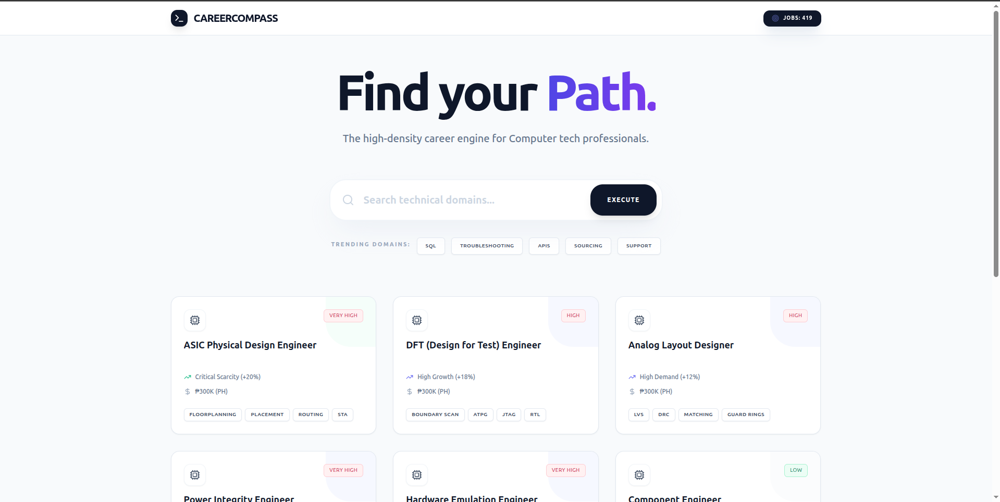

# Career Compass

**Live Website:** https://my-career-compass-tool.vercel.app/

Career Compass is a career search engine designed to assist individuals trying to break into the tech industry, as well as recent graduates who are uncertain about their career path.

The traditional job search process often relies on knowing specific job titles. Career Compass reverses this dynamic by allowing users to input their existing skills to discover roles that align with their capabilities. It serves as a bridge between academic or self-taught skills and actual industry requirements.

## Technologies Used

This project utilizes a modern hybrid stack, leveraging Python for high-performance data processing and React for a responsive user interface.

* **Frontend:** React (powered by Vite)
* **Backend:** FastAPI (Python)
* **Orchestration:** Node.js (Handles concurrency to run both servers simultaneously)

## Features

* **Skill-Based Matching:** Eliminates the need to search by job title; finds roles based on what the user can actually do.
* **Role Explorer:** Provides detailed insights into various tech positions to educate users on what different jobs entail.
* **Gap Analysis:** Highlights missing skills required for specific roles to guide further learning.
* **Resource Recommendations:** Suggests documentation or courses for bridging skill gaps.

## How to Use

1. **Access the Tool:** Navigate to the live website provided above.
2. **Input Skills:** In the search bar, enter your current technical skills (e.g., Python, SQL, React) and soft skills.
3. **Review Matches:** The algorithm will generate a list of job roles that match your skill set.
4. **Explore Roles:** Click on specific job titles to view detailed descriptions and identify any skill gaps.

## Local Development Setup

This project is open source. To run this application locally, you will need both Node.js and Python installed on your machine.

### Prerequisites

* Node.js & npm
* Python 3.8+
